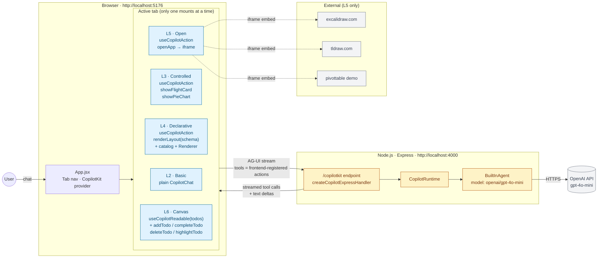

```mermaid


flowchart LR
    User((User))

    subgraph Browser["Browser · http://localhost:5176"]
        direction TB
        App["App.jsx<br/>Tab nav · CopilotKit provider"]

        subgraph Tabs["Active tab (only one mounts at a time)"]
            direction TB
            L2["L2 · Basic<br/>plain CopilotChat"]
            L3["L3 · Controlled<br/>useCopilotAction<br/>showFlightCard<br/>showPieChart"]
            L4["L4 · Declarative<br/>useCopilotAction<br/>renderLayout(schema)<br/>+ catalog + Renderer"]
            L5["L5 · Open<br/>useCopilotAction<br/>openApp → iframe"]
            L6["L6 · Canvas<br/>useCopilotReadable(todos)<br/>+ addTodo / completeTodo<br/>deleteTodo / highlightTodo"]
        end

        App --> Tabs
    end

    subgraph Backend["Node.js · Express · http://localhost:4000"]
        direction TB
        EP["/copilotkit endpoint<br/>createCopilotExpressHandler"]
        Runtime["CopilotRuntime"]
        Agent["BuiltInAgent<br/>model: openai/gpt-4o-mini"]
        EP --> Runtime --> Agent
    end

    OpenAI[("OpenAI API<br/>gpt-4o-mini")]

    subgraph External["External (L5 only)"]
        Excalidraw["excalidraw.com"]
        TLDraw["tldraw.com"]
        Pivot["pivottable demo"]
    end

    User -->|chat| App
    Tabs -->|"AG-UI stream<br/>tools = frontend-registered actions"| EP
    EP -->|"streamed tool calls<br/>+ text deltas"| Tabs
    Agent -->|HTTPS| OpenAI
    L5 -.->|iframe embed| Excalidraw
    L5 -.->|iframe embed| TLDraw
    L5 -.->|iframe embed| Pivot

    classDef tab fill:#e0f2fe,stroke:#0369a1,color:#0c4a6e
    classDef backend fill:#fef3c7,stroke:#b45309,color:#78350f
    classDef external fill:#f3f4f6,stroke:#6b7280,color:#374151
    class L2,L3,L4,L5,L6 tab
    class EP,Runtime,Agent backend
    class Excalidraw,TLDraw,Pivot,OpenAI external


```