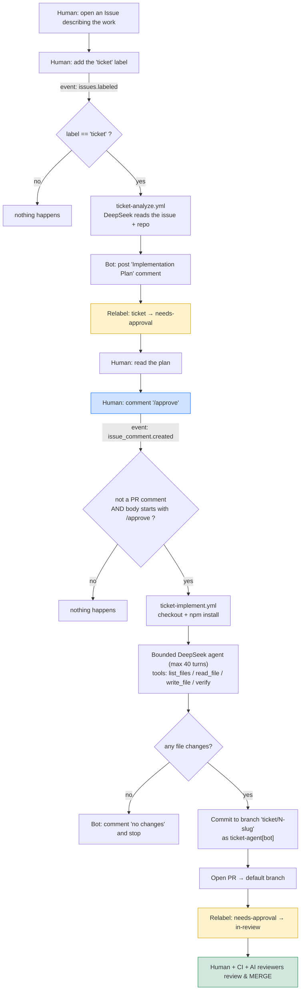
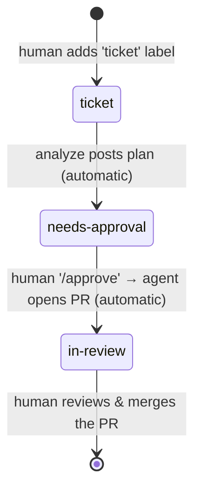
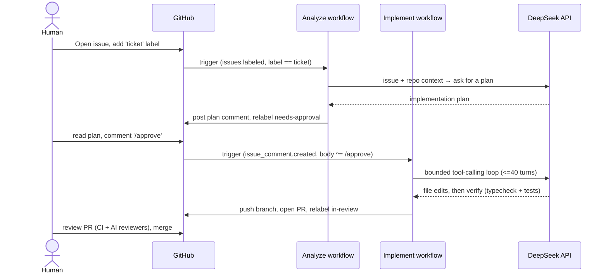

# Ticket pipeline runbook (end-to-end, with diagrams)

A visual runbook for the **Issue → Ticket → Code** pipeline. Pairs with
[ticket-system.md](ticket-system.md) (the flow + safety notes) and
[depending-on-the-ticket-system.md](depending-on-the-ticket-system.md) (what it
depends on). This page adds the diagrams and a copy-paste operating procedure.

## Worked example

The pipeline was used to fix the pipeline's own documentation gap:

1. Opened an issue noting the docs were missing a required GitHub setting
   ([#8](https://github.com/0XFF-96/Perth-Agent-Con-Workshop/issues/8)).
2. Added the **`ticket`** label → the analyze workflow posted an implementation
   plan in ~22s and relabeled the issue **`needs-approval`**.
3. Before approving, a check found **"Allow GitHub Actions to create and approve
   pull requests" was OFF** (`can_approve_pull_request_reviews: false`) — exactly
   the gap the issue documents. Approving first would have pushed a branch but hit
   a **403 at PR creation**.
4. Enabled the setting, then commented **`/approve`** → the implement workflow ran
   a bounded agent (~1m21s) and opened a PR
   ([#9](https://github.com/0XFF-96/Perth-Agent-Con-Workshop/pull/9)), relabeling
   the issue **`in-review`**.

Net: the pipeline both fixed the doc gap and surfaced the setting gotcha before it
could bite.

---

## 1. End-to-end flow

## 2. Labels are the ticket state machine

## 3. Who calls whom

---

## How to do it

### One-time setup (per repo)

1. **Add the `DEEPSEEK_API_KEY` repo secret** — Settings → Secrets and variables →
   Actions. (Same secret the PR-review workflows use; any OpenAI-compatible
   provider works via `LLM_API_ENDPOINT` / `LLM_MODEL`.)
2. **Enable PR creation by Actions** — Settings → Actions → General → Workflow
   permissions → check **"Allow GitHub Actions to create and approve pull
   requests"**. *Without this, the implement stage pushes the branch but 403s when
   opening the PR.*
3. **Workflows must live on the default branch** — `issues` / `issue_comment`
   events only run workflows defined on `main`.
4. The `ticket`, `needs-approval`, and `in-review` labels are **created
   automatically** the first time they're applied.

### Per ticket

1. **Open an issue** — the clearer and more scoped, the better the plan and the
   implementation.
2. **Add the `ticket` label** — within ~1 min a plan comment appears and the label
   flips to `needs-approval`.
3. **Read the plan.** If it's right, **comment `/approve`** on the issue.
4. The agent implements it, opens a **PR** linked to the issue, and the label flips
   to `in-review`.
5. **Review the PR like any other — nothing is merged automatically.**

### Guardrails (why this is safe)

- **Human-in-the-loop is mandatory**: analysis and `/approve` are separate steps;
  implementation only ever opens a PR.
- **Bounded agent**: max 40 turns; file access confined to the repo root (path
  traversal rejected); only `list_files` / `read_file` / `write_file` / `verify`
  tools — no arbitrary shell.
- **Cost / access**: each `/approve` spends API budget and runs a write-capable
  job. Anyone who can comment can `/approve`, so gate via repo permissions (low
  risk on a private repo, a real consideration if you make it public).

---

*Reference implementation: `.github/workflows/ticket-analyze.yml`,
`.github/workflows/ticket-implement.yml`, `.github/scripts/ticket-analyze.mjs`,
`.github/scripts/ticket-implement.mjs`.*
